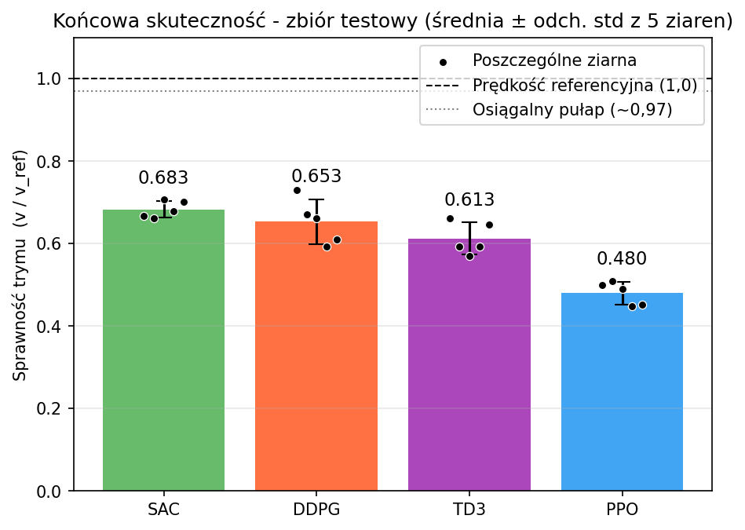
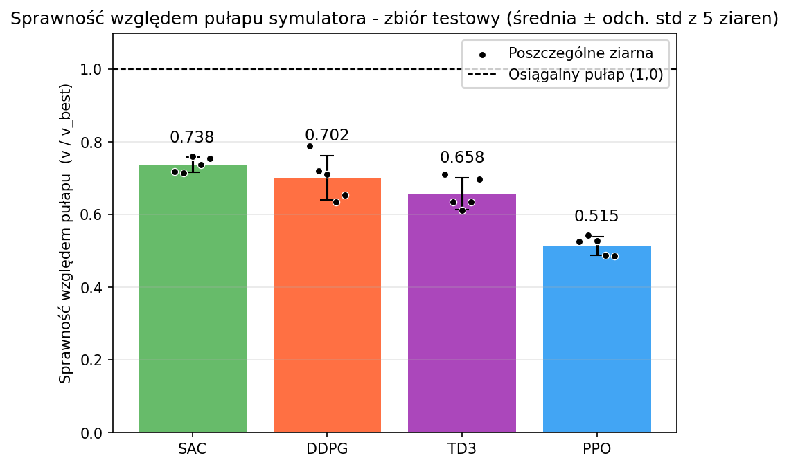
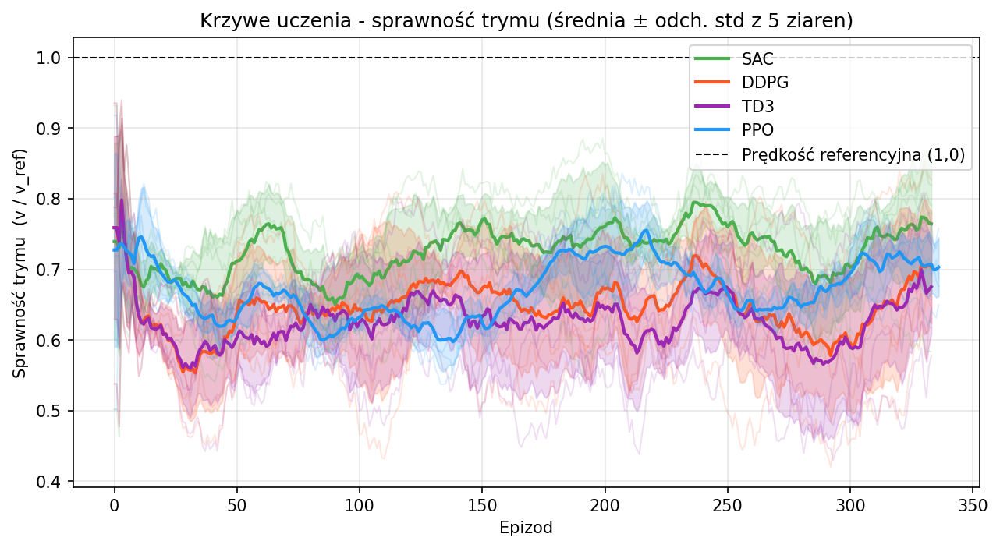
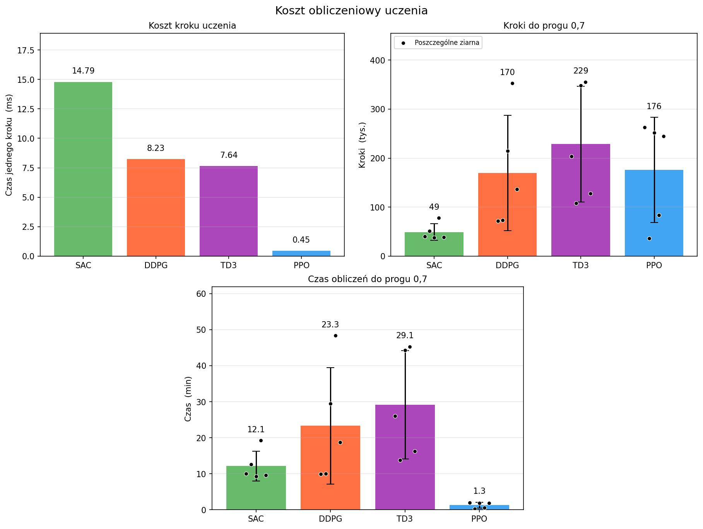

# Reinforcement learning for sail trim optimization in a simulated yacht model

This is a master's-thesis project that trains and compares deep reinforcement learning (DRL)
agents which learn to trim a sailboat's sail autonomously, in a simulated environment.

## Problem

*Sail trim* - the angle of the sail relative to the wind - determines how much drive a
sailboat generates. Finding the best angle is a continuous, non-linear control problem
that changes constantly with the strength and direction of the wind. Here the agent must
discover good sail settings **without being given the yacht's physics equations**
(model-free), so as to maximize boat speed.

Four algorithms are trained and compared, covering on-policy and off-policy families:

- **PPO** (Proximal Policy Optimization) - on-policy
- **SAC** (Soft Actor-Critic) - off-policy
- **DDPG** (Deep Deterministic Policy Gradient) - off-policy
- **TD3** (Twin Delayed DDPG) - off-policy

## Simulator

The simulation environment is built on the open-source [`gym-sailing: A sailing environment for OpenAI Gym / Gymnasium`](https://github.com/Gabo-Tor/gym-sailing) simulator by
Gabriel Torre.
The original simulator models sailing a boat toward a goal, with steering. For this project
it was **repurposed for the sail-trim subproblem** and modified substantially:

- **Single boat, no steering** - kept only the sailing yacht with a continuous action space
  (the original also had a motorboat and a discrete-action sailboat) and removed heading/rudder
  control, so only the trim is optimized.
- **New physics model** - the original drive force was a simple function of the course-to-wind
  angle with no notion of trim; it was replaced with a calibrated lift + drag sail-force model
  matched to the reference yacht.
- **Real wind input** - wind speed and direction (from the ERA5 dataset) now drive the boat's speed.
- **Redefined MDP** - the observation now uses wind speed, wind direction and sail angle; the
  action is the sail angle (not the rudder); the reward maximizes speed toward the polar
  reference (instead of reaching a goal).
- **New visualization** - the yacht sails up the screen, with a wind arrow (top-right) and live
  metrics along the bottom.

Training and evaluation use a new Gymnasium environment, `SailTrimEnv`, which can be run in
**three modes** via its `render_mode` argument:

- `None` - headless, no rendering (used for training and evaluation; fastest),
- `"human"` - a live pygame window (shown below) to watch the agent trim in real time,
- `"rgb_array"` - returns each frame as an RGB array, e.g. to record a video.

The mode is selected by the `RENDER_MODE` setting in [`main/config.py`](main/config.py).

<p align="center">
  
</p>


## Data

| Value | Description | Files |
|---|---|---|
| **Wind** | [ERA5 hourly data on single levels from 1940 to present](https://cds.climate.copernicus.eu/datasets/reanalysis-era5-single-levels?tab=overview)<br>Subset used: 2025 (all months & hourly), 10 m u- & v-wind components, Baltic Sea (60.0°N–54.0°N, 10.0°E–22.0°E) | `data/datasets/era5_dataset.nc` |
| **Polar** | Performance polar (target boat speeds vs wind angle/speed) of a [Beneteau First 40.7 yacht](https://www.seapilot.com/features/download-polar-files/) (provides the reference speed) | `data/datasets/First40_7.pol` |

The wind data is split **temporally** into training / validation / test sets (weekly blocks)
so evaluation is done on wind the model never saw during training.


## Outputs

| Location | Contents |
|---|---|
| `results/models/` | Trained models (`.zip`) and observation-normalization stats (`.pkl`) |
| `results/metrics/` | Training logs (`results_*.csv`), deterministic-eval results (`eval_*.csv`), summaries (`eval_summary.csv`, `eval_by_wind.csv`), compute-time measurement (`benchmark_time.csv`) |
| `results/plots/500000/training/` | Learning curves, reward, speed error, per-condition training plots, compute-cost comparison |
| `results/plots/500000/evaluation/` | Deterministic test plots: overall efficiency, per point-of-sail, per wind speed, and a heatmap |

## Setup

From the repository root:

```bash
python -m venv .venv
.venv\Scripts\activate          # Windows;  use  source .venv/bin/activate  on Linux/macOS
pip install -e .
```

On **Windows / PowerShell**, force UTF-8 output so logs and plots containing `°` (degrees) don't crash the console:

```powershell
$env:PYTHONIOENCODING = "utf-8"
```

## Configuration

Every setting lives in a single file, [`main/config.py`](main/config.py) - there are no
command-line arguments anywhere in the project. Change a value there and every script picks
it up. The main groups are:

| Group | Settings |
|---|---|
| Simulation | `FIXED_HEADING`, `RENDER_MODE` |
| Training | `TIME_STEPS`, `MAX_EPISODE_STEPS`, `SEEDS`, `SUFFIX`, `ALGORITHMS` |
| Validation (best-model checkpointing) | `VAL_EPISODES`, `VAL_MAX_STEPS`, `EVAL_FREQ` |
| Evaluation | `N_EPISODES`, `EVAL_SEED`, `MIN_REF_SPEED`, `BANDS_ORDER` |
| Learning speed / statistics | `EFF_THRESHOLDS`, `TIME_THRESHOLD`, `ALPHA` |
| Compute benchmark | `BENCH_STEPS`, `BENCH_SEED`, `INFER_ACTIONS`, `RUN_CPU_CONTROL` |
| Plotting | `SMOOTH`, `COLORS`, `TWA_BINS`, `BAND_LABELS` |
| Data paths | `WIND_RAW_NC`, `POLAR_RAW_POL`, `DEFAULT_POLAR_CSV`, `DEFAULT_WIND_CSV`, `WIND_TRAIN` / `WIND_VAL` / `WIND_TEST` |
| Output paths | `MODELS_DIR`, `METRICS_DIR`, `PLOTS_DIR_TRAIN`, `PLOTS_DIR_EVAL`, `BENCHMARK_CSV`, `EVAL_BY_WIND_CSV` |

`SUFFIX` tags one experiment run: models and CSVs are named `{seed}{SUFFIX}` (e.g. `42v2`).
Bumping it starts a fresh set of runs without overwriting the previous ones - but the
analysis scripts then only see runs with the **current** `SUFFIX`.

Hyperparameters of the four algorithms are not in the config: they live in
`default_params()` in [`training/train.py`](training/train.py), which the compute benchmark
imports as well, so both always measure the same configuration.

## Running the full pipeline

All scripts run as modules from the repository root and take **no command-line arguments**.

**1. Prepare the data** - download the necessary datasets and place them in the appropriate directories (only needed once - the processed CSVs are already included):

```bash
python -m data.wind_data_preprocessing    # era5_dataset.nc         -> wind_data_gdansk.csv
python -m data.polar_data_preprocessing   # First40_7.pol           -> First40_7.csv
python -m data.split_wind_data            # wind_data_gdansk.csv    -> train / val / test wind CSVs
```

**2. Train** the four algorithms across five seeds (-> models + training logs):

```bash
python -m main.main

# To train a single algorithm instead of all four, use its per-algorithm entry point:
python -m main.run_ppo      # or: run_sac, run_ddpg, run_td3
```

**3. Evaluate** the best checkpoints deterministically on the held-out test set:

```bash
python -m training.evaluate
```

**4. Measure the computation cost** of each algorithm:

```bash
python -m training.benchmark_time
```

Set `RUN_CPU_CONTROL = True` in the config to additionally re-measure everything on the CPU.

**5. Learning-speed metrics and statistical significance tests:**

```bash
python -m training.learning_speed         # AULC + steps to reach EFF_THRESHOLDS
python -m training.statistical_tests      # pairwise t Welch / U Mann-Whitney
```

**6. Generate the figures:**

```bash
python -m utils.plot_training_results     # training curves & summaries
python -m utils.plot_deterministic        # test plots: overall, per point-of-sail, ceiling
python -m utils.plot_wind_speed           # test plots: per wind speed + heatmap
python -m utils.plot_compute_time         # compute cost: ms/step, steps and time to threshold
```

## Results

The plots below summarize the **final performance** on the held-out test set, averaged over
five seeds (dots = individual seeds).

<table align="center">
  <tr>
    <th><div align="center">Trim efficiency&nbsp;&nbsp;(v / v_ref)</div></th>
    <th><div align="center">Efficiency vs simulator ceiling&nbsp;&nbsp;(v / v_best)</div></th>
  </tr>
  <tr>
    <td align="center"></td>
    <td align="center"></td>
  </tr>
</table>

**Left** - efficiency relative to the real-boat reference speed: the off-policy methods
(SAC, DDPG, TD3) clearly outperform on-policy PPO, and **SAC and DDPG reach the highest values**,
though none fully matches the reference. <br>

**Right** - efficiency relative to the best speed
achievable inside the simulator: the values are higher, showing that part of the shortfall on
the left comes from the simulator's physical ceiling rather than from imperfect trimming.

---

The learning curves below (trim efficiency over training episodes, 5-seed mean, shaded = std)
show that **SAC learns fastest and stays the highest** throughout, while DDPG, TD3 and PPO stay
bunched lower; none reaches the reference during training.

<p align="center">
  
</p>

---

The plots below break the cost of reaching the 0.7 efficiency threshold into the cost of one
environment step, the steps needed, and the resulting wall-clock time.

<p align="center">
  
</p>

**SAC needs the fewest steps (~49k vs ~176k for PPO), but the most time.** An off-policy step
runs a gradient update on every environment step, making it ~30x more expensive than a PPO
step, so the ranking **reverses in wall-clock time**: PPO reaches the threshold in ~1.3 min,
SAC in ~12 min, DDPG and TD3 in 23-29 min.

